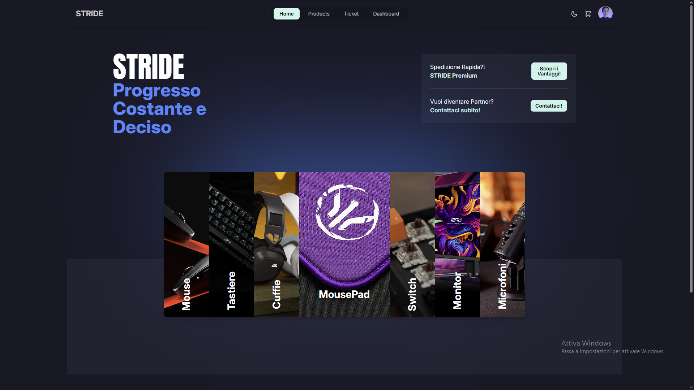
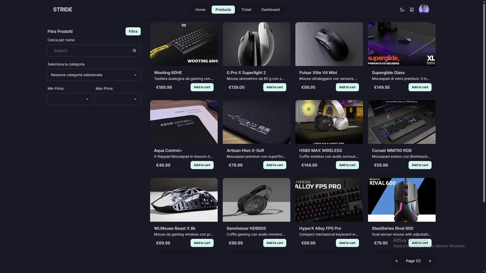
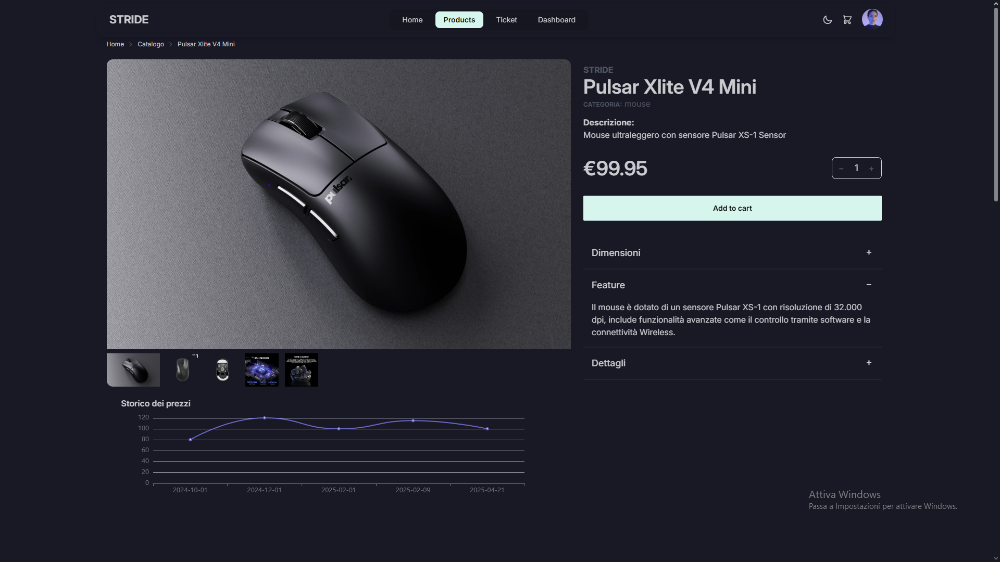
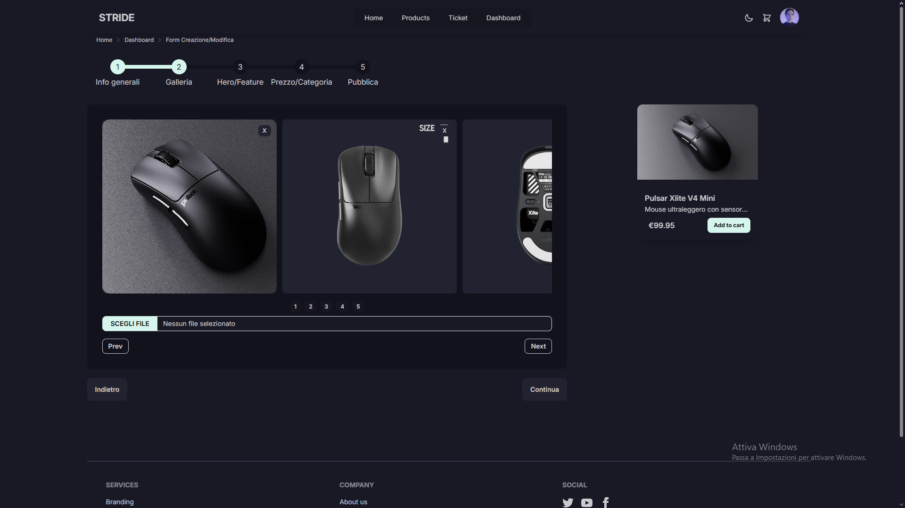

# 🛒 Prototipo E-commerce – Periferiche Gaming & Professionali

Benvenuto nel repository del mio progetto e-commerce!  
Si tratta di un **prototipo completo** di sito dedicato alla vendita di **periferiche da gaming e accessori professionali**, sviluppato full stack per simulare un'esperienza realistica di acquisto online.

---

## 🔗 Live Demo

👉 [Guarda il progetto online](https://stride-shop.netlify.app)  
*(Sostituisci con il link se è online – altrimenti puoi rimuovere questa sezione)*

---

## 📌 Funzionalità principali

- Navigazione semplice e interfaccia responsive
- Catalogo prodotti dinamico
- Carrello e checkout funzionanti
- Integrazione con **Stripe** per i pagamenti online
- Upload e gestione immagini prodotti tramite **Cloudinary**
- Autenticazione base (se implementata)
- Gestione lato admin simulata (prodotti, immagini, prezzi)

---

## 🧰 Stack Tecnologico

### Frontend
- **Angular**
- **TailwindCSS** + **DaisyUI** per componenti moderni e responsive

### Backend
- **Spring Boot** (Java)
- **PostgreSQL** per la gestione del database relazionale

### Integrazioni
- **Stripe** per il pagamento sicuro con carta
- **Cloudinary** per il caricamento e hosting delle immagini prodotto

---

## 🖥️ Screenshot

